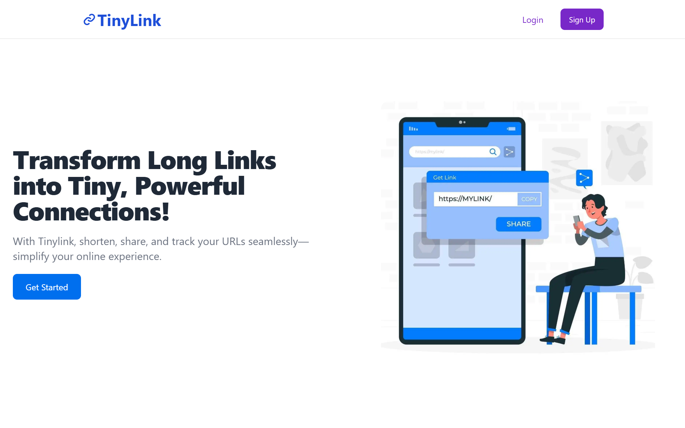

# 🔗 Tiny Link - URL Shortener

A full-stack MERN application for shortening URLs with user authentication, analytics, and QR code generation.



## ✨ Features

- **User Authentication**: Secure login/signup with JWT
- **URL Shortening**: Generate short URLs with unique IDs or custom aliases
- **Analytics**: Track click counts and view statistics
- **QR Codes**: Generate and download QR codes for any URL
- **Social Sharing**: Share links on multiple platforms
- **Responsive Design**: Works on all devices

## 🛠️ Tech Stack

- **Frontend**: React, Tailwind CSS, Hero UI
- **Backend**: Node.js, Express
- **Database**: MongoDB
- **Authentication**: JWT
- **QR Generation**: react-qr-code

## 🚀 Quick Start

### Prerequisites

- Node.js v14+
- MongoDB (Atlas or local)
- npm or yarn

### Installation

1. Clone the repository:

```bash
git clone https://github.com/yusha0123/Url-Shortener
cd tiny-link
```

2. Set up the backend:

```bash
cd server
npm install
```

3. Create `.env` file in `server` directory:

```env
MONGO_URI=your_mongodb_connection_string
JWT_SECRET=your_jwt_secret_key
PORT=8080
```

4. Set up the frontend:

```bash
cd ../client
npm install
npm run build
```

### Running the Application

```bash
cd ../server
npm start
```

The app will be available at `http://localhost:8080`

## ⚙️ Configuration

| Environment Variable | Description                 | Required |
| -------------------- | --------------------------- | -------- |
| MONGO_URI            | MongoDB connection string   | Yes      |
| JWT_SECRET           | Secret for JWT tokens       | Yes      |
| PORT                 | Server port (default: 8080) | No       |

## 📂 Project Structure

```
tiny-link/
├── client/          # React frontend
│   ├── public/
│   └── src/
├── server/          # Express backend
│   ├── controllers/
|   ├── middlewares/
│   ├── models/
│   ├── routes/
│   └── utils/
└── README.md
```

## 🤝 Contributing

Pull requests are welcome. For major changes, please open an issue first.
